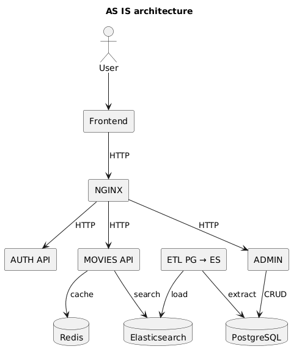
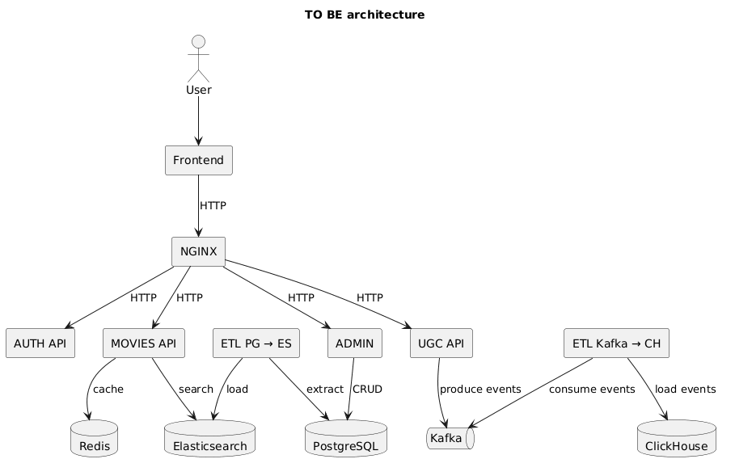

# Architecture

## AS IS

### Description

- AUTH API отвечает за аутентификацию пользователей.
- MOVIES API использует Elasticsearch для поиска.
- Redis используется для кеширования.
- ETL переносит данные из PostgreSQL в Elasticsearch.

---

## TO BE

### Description

- Добавлен UGC API для сбора пользовательских событий.
- Frontend отправляет события пользовательской активности в UGC API.
- UGC API публикует события в Kafka.
  - Kafka используется как промежуточный слой
  между сервисом сбора событий и аналитическим ETL,
  что позволяет асинхронно обрабатывать пользовательские события
  и снизить нагрузку на основную систему.
- ETL Kafka → ClickHouse переносит события в аналитическое хранилище.
- ClickHouse используется для хранения пользовательской аналитики.