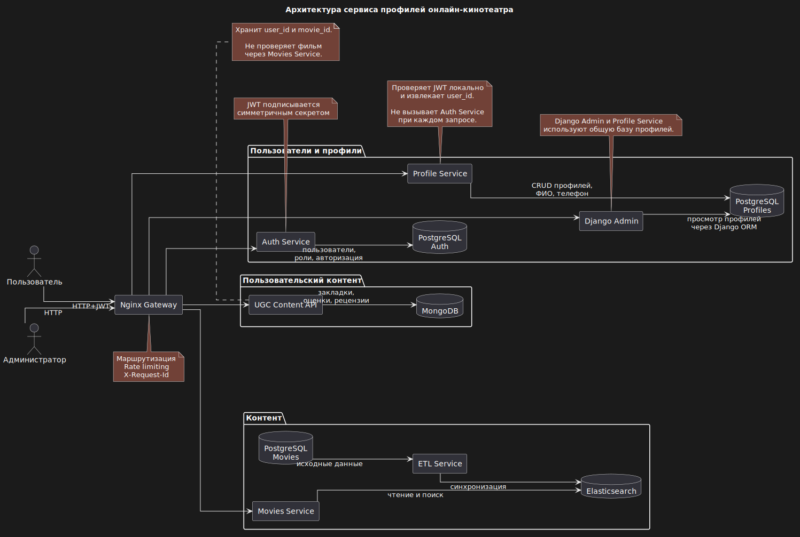

# Профили пользователей

Сервис управления профилями пользователей.

## Функциональные требования

#### Профиль пользователя

1. Пользователь должен иметь возможность создать свой профиль.
2. Пользователь должен иметь возможность просматривать свой профиль.
3. Пользователь должен иметь возможность изменять свой профиль.
4. Пользователь должен иметь возможность удалить свой профиль.

#### Понравившиеся фильмы

1. Пользователь должен иметь возможность добавлять фильмы в список избранного.
2. Пользователь должен иметь возможность удалять фильмы из списка избранного.
3. Пользователь должен иметь возможность просматривать список избранных фильмов.

#### Оценки

1. Пользователь должен иметь возможность выставлять оценки фильмам.
2. Пользователь должен иметь возможность изменять ранее выставленную оценку
   фильму.
3. Пользователь должен иметь возможность удалять ранее выставленную оценку
   фильму.

#### Просмотр информации о фильме

1. Клиент должен иметь возможность просматривать рецензии к фильму постранично.
2. Клиент должен иметь возможность просматривать средний пользовательский
   рейтинг фильма.

#### Рецензии

1. Пользователь должен иметь возможность писать рецензии на фильмы.
2. Пользователь должен иметь возможность редактировать написанную им рецензию.
3. Пользователь должен иметь возможность удалять написанную им рецензию.

#### Администрирование

1. Администратор с соответствующими правами должен иметь доступ к просмотру
   профилей пользователей через административную панель.

## Нефункциональные требования

#### Безопасность

1. Пользователь должен иметь доступ только к своему профилю.
2. Просматривать персональные данные чужих профилей через административную
   панель могут только сотрудники с соответствующим разрешением.
3. Номер телефона не должен попадать в публичные ответы с рецензиями,
   рейтингами и информацией о фильме.
4. Операции создания, изменения и удаления профиля, закладок, оценок и рецензий
   должны быть доступны только аутентифицированным пользователям.
5. Пользователь не должен иметь возможности изменять или удалять чужие оценки,
   рецензии и закладки.

#### Производительность

1. Время обработки типовых API-запросов не должно превышать 300 мс
   при штатной нагрузке без учёта сетевой задержки клиента.

#### Надёжность и качество API

1. API должно возвращать корректные HTTP-коды.
2. Некорректные входные данные должны приводить к ответам с кодами 4XX.
3. Необработанные ошибки не должны приводить к раскрытию внутренних данных
   приложения.
4. Количество ответов с кодами 5XX должно быть минимальным.

#### Инфраструктура

1. Система должна запускаться через Docker Compose.
2. API должно быть документировано с помощью OpenAPI/Swagger.
3. Конфигурация должна храниться в переменных окружения.
4. Секретные данные не должны храниться в репозитории.

#### Валидация и целостность данных

1. Перед сохранением номер телефона должен приводиться к единому формату.
2. Нормализованный номер телефона должен быть уникальным.
3. Один пользователь может иметь только один профиль.
4. Один пользователь может добавить конкретный фильм в избранное только один
   раз.
5. Один пользователь может поставить конкретному фильму только одну оценку.
6. Один пользователь может написать конкретному фильму только одну рецензию.
7. Рейтинг фильма должен быть целым числом от 1 до 10.

## Сущности

```
Profile
Bookmark
MovieRating
Review
```

```
Profile
-------
id UUID
user_id UUID
phone VARCHAR
first_name VARCHAR
middle_name VARCHAR nullable
last_name VARCHAR
created_at TIMESTAMPTZ
updated_at TIMESTAMPTZ

unique: user_id
unique: phone

phone — нормализованный номер в формате E.164
например: +79991112233
```

```
Bookmark
--------
bookmark_id
movie_id
user_id
created_at
updated_at
unique: user_id + movie_id
```

```
MovieRating
-----------
movie_id
user_id
score
created_at
updated_at
unique: user_id + movie_id
```

```
Review
------
review_id
user_id
movie_id
title
text
created_at
updated_at
unique: user_id + movie_id
```

#### Связи между сущностями

```
User 1 ─── 0..1 Profile
User 1 ─── N Bookmark    N ─── 1 Movie
User 1 ─── N MovieRating N ─── 1 Movie
User 1 ─── N Review      N ─── 1 Movie
```

Один пользователь может не иметь профиля либо иметь один профиль.

Один пользователь может добавить в избранное много фильмов, а один фильм
может быть добавлен в избранное многими пользователями.

Один пользователь может оценить много фильмов, а один фильм может получить
оценки от многих пользователей.

Один пользователь может написать рецензии на разные фильмы, а один фильм
может иметь рецензии от многих пользователей.  
При этом пользователь может
написать только одну рецензию на конкретный фильм.

## Источники данных и ответственности сервисов

`Auth Service` является источником истины для учётных записей пользователей.
После аутентификации он выдаёт JWT, содержащий `user_id`.

`Profile Service` проверяет подпись JWT локально с помощью общего
симметричного секрета и не выполняет синхронный запрос в `Auth Service`.

`PostgreSQL Movies` является первичным хранилищем данных о фильмах.

`ETL Service` переносит изменения из PostgreSQL в Elasticsearch.

`Movies Service` предоставляет клиентским приложениям API для чтения и поиска
фильмов в Elasticsearch.

Информация о фильме получается клиентом через `Movies Service`.

`UGC Content API` хранит только `movie_id` и не проверяет существование фильма
синхронным запросом к `Movies Service`.

Сервис профилей хранит персональные данные пользователя: ФИО и номер телефона.

`UGC Content API` хранит избранные фильмы, пользовательские оценки и рецензии
в `MongoDB`.

В рамках дипломного проекта `Profile Service` и `Django Admin` используют
общую базу профилей. Это осознанное упрощение: административная панель работает
с данными через Django ORM, тогда как пользовательское API реализовано отдельным
сервисом. Схема базы должна изменяться централизованно с помощью миграций.

Связи между данными разных сервисов являются логическими и строятся через
`user_id` и `movie_id`. Ограничения внешних ключей между базами разных
сервисов не используются.

# Архитектура

## Компоненты системы

### Auth Service

- регистрирует и аутентифицирует пользователей;
- выдаёт JWT;
- является источником `user_id`.

### Profile Service

- создаёт, возвращает, изменяет и удаляет профиль пользователя;
- хранит ФИО и нормализованный номер телефона;
- контролирует уникальность номера телефона и профиля пользователя;
- разрешает пользователю работать только со своим профилем;
- получает `user_id` из JWT.

### Movies Service

- предоставляет API для получения информации о фильмах;
- выполняет поиск и чтение данных из Elasticsearch;
- является внешним источником информации о фильмах для клиентских приложений.

### ETL Service

- читает данные о фильмах из PostgreSQL;
- отслеживает изменения;
- переносит и обновляет данные в Elasticsearch.

### UGC Content API

- хранит пользовательские оценки фильмов;
- хранит рецензии на фильмы;
- хранит закладки пользователей;
- позволяет получить список закладок пользователя;
- позволяет получить средний рейтинг фильма;
- позволяет получить рецензии к фильму постранично;
- хранит ссылки на пользователей и фильмы в виде `user_id` и `movie_id`.

### Django Admin

- предоставляет административный интерфейс для просмотра профилей;
- ограничивает доступ к персональным данным с помощью прав Django;
- работает с PostgreSQL сервиса профилей.

### Nginx

- является единой точкой входа в систему;
- маршрутизирует запросы к внутренним сервисам;
- скрывает внутренние адреса сервисов от клиента;
- ограничивает частоту запросов по IP-адресу;
- возвращает код `429 Too Many Requests` при превышении лимита;
- генерирует и передаёт сервисам заголовок `X-Request-Id`;
- записывает `request_id` в журнал доступа.

## Хранилища данных

```
Auth Service ─────────────→ PostgreSQL Auth

PostgreSQL Movies ──→ ETL Service ──→ Elasticsearch
Movies Service ─────────────────────→ Elasticsearch

Profile Service ──────────→ PostgreSQL Profiles
Django Admin ─────────────→ PostgreSQL Profiles

UGC Content API ──────────→ MongoDB
```

## Взаимодействие компонентов

```
Клиент → Nginx → Auth Service
Клиент → Nginx → Profile Service
Клиент → Nginx → Movies Service
Клиент → Nginx → UGC Content API

Администратор → Nginx → Django Admin

Profile Service → PostgreSQL Profiles
Django Admin → PostgreSQL Profiles
UGC Content API → MongoDB
Movies Service → Elasticsearch
ETL Service: PostgreSQL Movies → Elasticsearch
```
## Диаграмма



## Описание эндпоинтов

#### Создать профиль

`POST /api/v1/profiles`  
`Authorization: Bearer <JWT>`

```json
{
  "phone": "+79999999999",
  "first_name": "Александр",
  "middle_name": "Иванович",
  "last_name": "Петров"
}
```

Ответ:
`201 Created`

```json
{
  "id": "profile-uuid",
  "user_id": "user-uuid",
  "phone": "+79999999999",
  "first_name": "Александр",
  "middle_name": "Иванович",
  "last_name": "Петров",
  "created_at": "2026-07-12T18:00:00Z",
  "updated_at": "2026-07-12T18:00:00Z"
}
```

Возможные ошибки:

* `401 Unauthorized` — нет или невалиден JWT;
* `409 Conflict` — профиль уже существует;
* `409 Conflict` — телефон уже используется;
* `422 Unprocessable Entity` — неверный формат данных.

---

#### Получить свой профиль

`GET /api/v1/profiles/me`  
`Authorization: Bearer <JWT>`

Ответ:  
`200 OK`

```json
{
  "id": "profile-uuid",
  "user_id": "user-uuid",
  "phone": "+79999999999",
  "first_name": "Александр",
  "middle_name": "Иванович",
  "last_name": "Петров",
  "created_at": "2026-07-12T18:00:00Z",
  "updated_at": "2026-07-12T18:30:00Z"
}
```

Возможные ошибки:

* `404 Not Found` - профиль не найден; 
* `401 Unauthorized` — нет или невалиден JWT;

---

#### Частично изменить профиль

`PATCH /api/v1/profiles/me`  
`Authorization: Bearer <JWT>`

В запросе должен присутствовать хотя бы один изменяемый атрибут.
Поля, отсутствующие в запросе, сохраняют прежние значения.

```json
{
  "phone": "+79991112233",
  "first_name": "Александр"
}
```

Удаление отчества (middle_name):

```json
{
   "middle_name": null
}
```

При изменении телефона новое значение нормализуется и проверяется на
уникальность. Текущий номер этого же профиля не считается конфликтом.

Например, изменение:  
`+7 999 111-22-33`  
На:  
`+79991112233`  
после нормализации не должно вызвать 409.  

Ответ:  
`200 OK`

Ответ содержит полное обновлённое представление профиля в формате `ProfileResponse`.

Возможные ошибки:

* `404 Not Found` — профиль не существует;
* `409 Conflict` — новый телефон уже занят;
* `401 Unauthorized` — нет или невалиден JWT;
* `422 Unprocessable Entity` — неверные данные или пустой запрос.

---

#### Удалить профиль

`DELETE /api/v1/profiles/me`  
`Authorization: Bearer <JWT>`

Ответ:
`204 No Content`

Возможные ошибки:

* `401 Unauthorized` — нет или невалиден JWT;